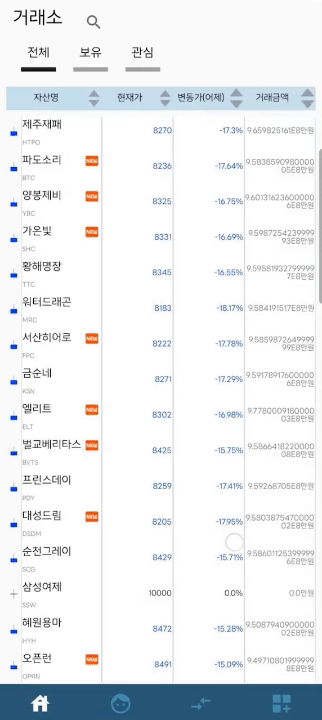
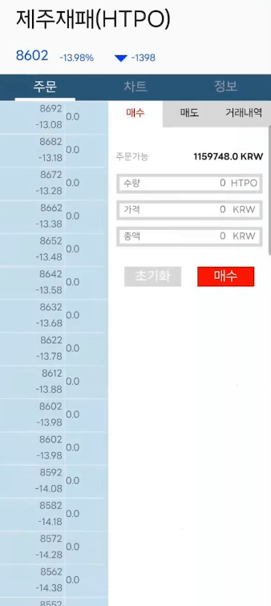
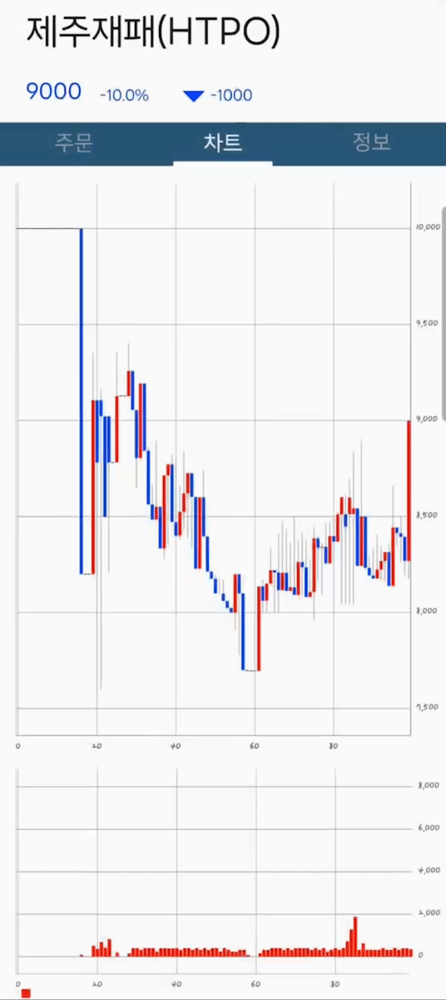
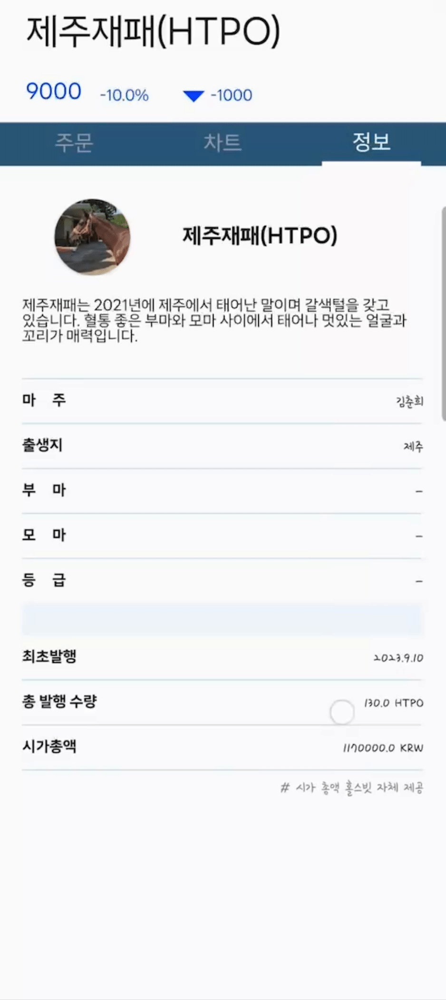
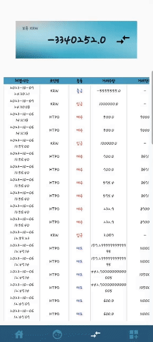
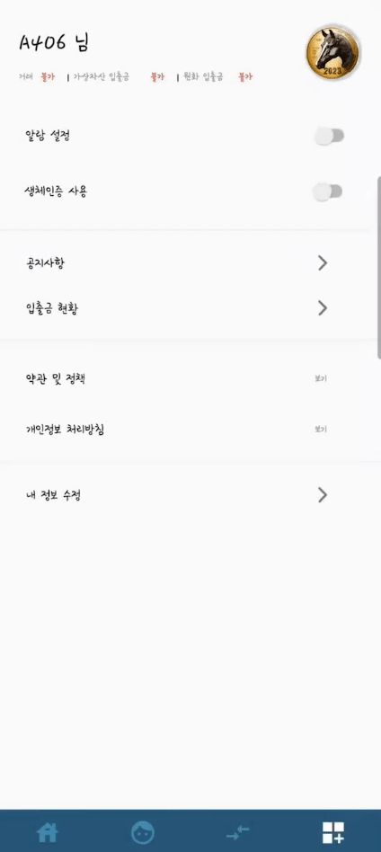
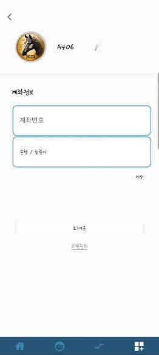
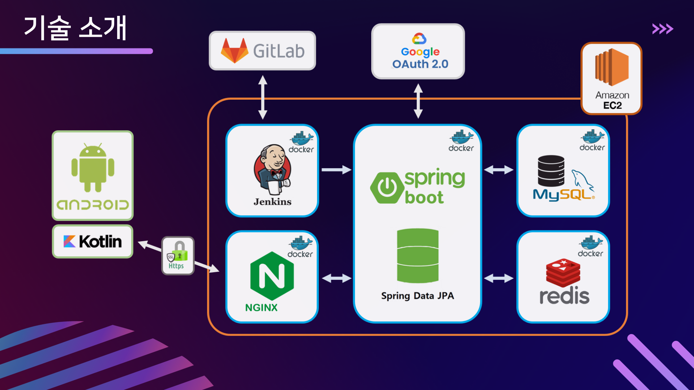
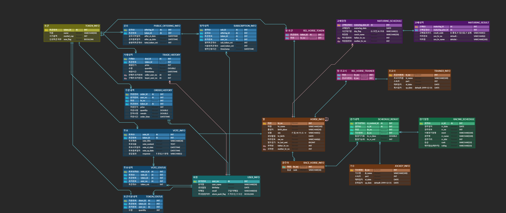

# SSAFY 9기 핀테크 특화프로젝트 

# 🐎 Hores Bit

## **0️⃣ 프로젝트 개요**

🎈 프로젝트명 : Horse Bit

📌 프로젝트 컨셉 : 조각투자를 이용한 경주마 소액 투자 거래소 플랫폼

🛠 개발 기간 : 23.08.28 ~ 23.10.6 (6주)


💻 사용 기술스택 : SpringBoot, Kotlin (4. 시스템 아키텍처 참고)


## **1️⃣ 팀원 정보 및 업무 분담 내역**

| 이름         | 역할     | 설명                                                         |
| ------------ | -------- | ------------------------------------------------------------ |
| 홍성민(팀장) | Backend  | ERD 설계<br />Spring Security와 JWT, OAuth2를 활용한 구글 로그인 api 구현<br />토큰을 활용한 암호화 및 사용자 인증 알고리즘 구현 <br />Spring Boot를 활용한 REST API 구현 <br />Spring Data JPA를 활용한 DB 구축 |
| 이재홍       | Backend  | DB(redis, mysql), Nginx, Jenkins, Docker 환경 구성<br />redis를 활용한 분산 락 기능 구성<br />Spring Boot를 활용한 Backend 구현 |
| 동화영       | Backend  | 프로젝트 기획 및 설계<br />기능명세서, 데이터베이스 설계서 API 문서 작성<br /> MySQL 기반의 데이터베이스 구축 및 데이터 관리<br />Spring Framework를 활용한 RESTful API 통신 서버 개발<br />Spring JPA를 활용하여 사용자 요청처리 및 데이터 관리 |
| 김용우       | Frontend | 프로젝트 기획 및 설계<br />Figma 제작<br />Kotlin을 사용한 안드로이드 어플리케이션<br />차트, 프래그먼트, 리사이클러뷰 |
| 김민태       | Frontend | 프로젝트 기획 및 설계<br />Figma 제작<br />Kotlin을 활용한  안드로이드 어플리케이션<br />OAuth2를 활용한 구글 로그인 프론트앤드 구현<br />안드로이드 생체 인식 인증 구현<br />README 작성 |
| 임서희       | Frontend | Figma 설계<br />OAuth2를 활용한 구글 로그인 프론트앤드 구현<br />Kotlin을 사용한 안드로이드 어플리케이션 |


## **2️⃣ 서비스 대표 기능**

<h4>App</h4>

| 기능        | 세부기능                                                     |
| ----------- | ------------------------------------------------------------ |
| 회원 기능   | - 구글 로그인을 통한, 회원가입 /  로그인 - 회원정보 변경 및 탈퇴 |
| 거래소      | - 전체, 보유, 관심 코인 조회 및 자산명, 현재가, 변동가, 거래금액으로 오름내림 차순 |
| 주문        | - 거래량 및 매수, 매도,  미체결, 체결 조회 가능              |
| 차트        | - 실시간 차트 및 거래량 변동 그래프 제공                     |
| 정보        | - 말(코인)에 대한 정보 제공(마주, 출생지, 부마, 발행일, 총 발향 수량, 시가총액 등) |
| 마이페이지  | - 총 보유자신, 매수, 평가 손익 , 수익률 및 보유 마패 시각화  |
| 입출금내역  | - 보유 KRW 및 현금 거래 서비스, 입출금 내역                  |
| 더보기      | - 알람 및 생체인증 제공 및 공지사항, 약관 및 정책, 내 정보 수정 |
| 내정보 수정 | - 이름 수정 및 계좌정보, 로그아웃, 회원탈퇴                  |


### **프로젝트의 특장점**

1. 생명과의 교감을 통한 투자 서비스
2. 실시간으로 반영되는 호가창과 차트
3. 높은 신뢰성을 바탕으로 다수의 거래 진행
4. 고가의 경주마 투자가 아닌 소액 투자


## 3️⃣ 서비스 화면

<h4>로그인</h4>


</hr>

<h4>거래소</h4>



</hr>

<h4>주문</h4>



</hr>

<h4>차트</h4>



</hr>

<h4>정보</h4>



</hr>

<h4>마이페이지</h4>


</hr>

<h4>입출금 내역</h4>



</hr>

<h4>더보기</h4>



</hr>

<h4>내정보 수정</h4>



</hr>


## 4️⃣ 시스템 아키텍처 및 개발 환경

<h4>🌐 공통</h4>

| 상세       |       내용        |
| ---------- | :---------------: |
| GitLab     |     형상 관리     |
| Jira       | 일정 및 이슈 관리 |
| Mattermost |   커뮤니케이션    |
| Notion     | 일정 및 문서 관리 |

</br>

<h4>📱 FrontEnd&BackEnd</h4>

| 상세           |  버전  |
| :------------- | :----: |
| Kotlin         |  1.8   |
| Java           |   17   |
| SpringBoot     | 3.1.3  |
| SpringSecurity |   6    |
| JWT            | 4.2.1  |
| redisson       | 3.23.4 |
| redis          |  7.2   |
| mysql          |  8.1   |
| Jenkins        | 2.423  |
| nginx          | 1.25.2 |
| docker         | 24.0.6 |


<h4>System Architecture</h4>




## 5️⃣ 컴포넌트 구조 및 프로토타입

<h4>📱 FrontEnd</h4>

```
📂 app
  ㄴ📂 java
 	 ㄴ📂 com.a406.horsebit
  		ㄴ🧩 APIS
  		ㄴ📘 AssetTavbleitemAdapter
  		ㄴ📘 DataModels.kt
  		ㄴ📘 ExcahngeFragemnet
  		ㄴ📘 HomeFragment
  		ㄴ📘 LoginMainActivity.kt
  		ㄴ📘 MainActivity
  		ㄴ📘 MoreFragement
  		ㄴ📘 MyEditFragemnet
  		ㄴ📘 MyPageFragment
  		ㄴ📘 OrderActivity
  		ㄴ📘 StockChartFragemnet
  		ㄴ📘 SwipHelperCallBack
    📂 res
      ㄴ📂 drawable
         ㄴ📄 main_log.png
         ㄴ📄 baseline_arrow.xml
         ㄴ📄 button_round.xml
         ㄴ📄 edge.xml
         ㄴ📄 ic_icon.xml
         ㄴ📄 rounded_shape.xml
         ㄴ📄 underline.xml
      ㄴ📂 font
      	 ㄴ📄 font.xml
      	 ㄴ📝 garket.ttf
      	 ㄴ📝 gmarket_sans.ttf
      	 ㄴ📝 line_seed.ttf
      ㄴ📂 layout
         ㄴ📄 activity_login.xml
         ㄴ📄 activity_main.xml
         ㄴ📄 asset_tavle_item.xml
         ㄴ📄 exchange_item.xml
         ㄴ📄 fragemnet_exchange.xml
         ㄴ📄 fragemnet_home.xml
         ㄴ📄 fragemnet_my_edit.xml
         ㄴ📄 fragemnet_order.xml
         ㄴ📄 fragemnet_stock_chart.xml
         ㄴ📄 myasset_item.xml
         ㄴ📄 popup_edit_name.xml
      ㄴ📂 mipmap
        ㄴ📂 ic_icon
        ㄴ📂 ic_icon_foreground
        ㄴ📂 ic_launcher      
      ㄴ📂 values
      	 ㄴ📄 colors.xml
      	 ㄴ📄 ic_icon_background.xml
      	 ㄴ📄 strings.xml
     		ㄴ📂 themes
      ㄴ📂 xml
      	 ㄴ📄 backup_rules.xml
      	 ㄴ📄 data_extraction_rules.xml
  🐘 Gradle Scripts
   ㄴ 🐘 build.gradle
   ㄴ 🐘 setting.gradle
```

<h4>💾 BackEnd</h4>

```
📂 src/main/java
  ㄴ📦 com.a406.horsebit
      ㄴ📦 aop
          ㄴ📄 AopForTransaction.java
          ㄴ📄 CustomSpringELParser.java
          ㄴ📄 DistributedLock.java
          ㄴ📄 DistributedLockAop.java
      ㄴ📦 cache
          ㄴ📄 CandleCache.java
      ㄴ📦 config
          ㄴ📦 jwt
              ㄴ📄 JwtAuthenticationEntryPoint.java
              ㄴ📄 JwtProperties.java
              ㄴ📄 TokenProvider.java
          ㄴ📦 oauth
              ㄴ📄 OAuth2UserCustomService.java
          ㄴ📄 RedissonConfig.java
          ㄴ📄 TokenAuthenticationFilter.java
          ㄴ📄 WebOAuthSecurityConfig.java
      ㄴ📦 constant
          ㄴ📄 CandleConstant.java
          ㄴ📄 OrderConstant.java
          ㄴ📄 PriceConstant.java
      ㄴ📦 controller
          ㄴ📄 AssetsController.java
          ㄴ📄 HorseController.java
          ㄴ📄 OrderController.java
          ㄴ📄 TokenController.java
          ㄴ📄 TradeController.java
          ㄴ📄 UserController.java
      ㄴ📦 domain
          ㄴ📦 redis
              ㄴ📄 Candle.java
              ㄴ📄 CandleType.java
              ㄴ📄 Order.java
              ㄴ📄 OrderSummary.java
              ㄴ📄 Price.java
              ㄴ📄 PriceRateOfChange.java
              ㄴ📄 VolumePage.java
          ㄴ📄 Account.java
          ㄴ📄 Bookmark.java
          ㄴ📄 BookmarkPK.java
          ㄴ📄 Horse.java
          ㄴ📄 HorseTokenRel.java
          ㄴ📄 HorseTokenRelPK.java
          ㄴ📄 Possess.java
          ㄴ📄 RefreshToken.java
          ㄴ📄 Token.java
          ㄴ📄 Trade.java
          ㄴ📄 TradeHistory.java
          ㄴ📄 User.java
      ㄴ📦 dto
          ㄴ📦 response
              ㄴ📄 CreateAccessTokenResponse.java
              ㄴ📄 TokenReponse.java
          ㄴ📦 request
              ㄴ📄 AddUserRequest.java
              ㄴ📄 TokenRequest.java
          ㄴ📄 AssetsDTO.java
          ㄴ📄 CandleDTO.java
          ㄴ📄 HorseDTO.java
          ㄴ📄 HorseTokenDTO.java
          ㄴ📄 OrderDTO.java
          ㄴ📄 OrderRequestDTO.java
          ㄴ📄 OrderResponseDTO.java
          ㄴ📄 PriceDTO.java
          ㄴ📄 PriceRateOfChangeDTO.java
          ㄴ📄 TokenDTO.java
          ㄴ📄 TradeDTO.java
          ㄴ📄 UserSettingDTO.java
          ㄴ📄 UserTradeDTO.java
          ㄴ📄 VolumeDTO.java
      ㄴ📦 exception
          ㄴ📄 CustomException.java
      ㄴ📦 exceptionhandler
          ㄴ📄 GlobalExceptionHandler.java
      ㄴ📦 google
          ㄴ📦 controller
              ㄴ📄 OAuthController.java
          ㄴ📦 domain
              ㄴ📄 OAuthAdapter.java
              ㄴ📄 OAuthConfig.java
              ㄴ📄 OAuthProperties.java
              ㄴ📄 OAuthProvider.java
              ㄴ📄 OIDCKey.java
              ㄴ📄 Role.java
          ㄴ📦 dto
              ㄴ📦 request
                  ㄴ📄 RefreshDTO.java
                  ㄴ📄 SignInDTO.java
                  ㄴ📄 SignUpDTO.java
                  ㄴ📄 UserDTO.java
              ㄴ📦 response
                  ㄴ📄 RefreshResponseDTO.java
                  ㄴ📄 SignInResponseDTO.java
                  ㄴ📄 SignUpResponseDTO.java
                  ㄴ📄 UserNameDuplicatedResponseDTO.java
          ㄴ📦 exception
              ㄴ📄 NoSuchUserException.java
              ㄴ📄 UnauthorizedException.java
          ㄴ📦 repository
              ㄴ📄 InMemoryProviderRepository.java
      ㄴ📦 repository
          ㄴ📦 redis
               ㄴ📄 CandleRepository.java
               ㄴ📄 OrderRepository.java
               ㄴ📄 PriceRepository.java
          ㄴ📄 AccountRepository.java
          ㄴ📄 BookmarkRepository.java
          ㄴ📄 PossessRepository.java
          ㄴ📄 RefreshTokenRepository.java
          ㄴ📄 TokenRepository.java
          ㄴ📄 TradeRepository.java
          ㄴ📄 UserRepository.java
      ㄴ📦 service
          ㄴ📄 AssetsService.java
          ㄴ📄 BookmarkService.java
          ㄴ📄 CandleService.java
          ㄴ📄 HorseService.java
          ㄴ📄 InitiatorService.java
          ㄴ📄 OrderAsyncService.java
          ㄴ📄 OrderService.java
          ㄴ📄 PriceService.java
          ㄴ📄 TokenService.java
          ㄴ📄 TradeService.java
          ㄴ📄 UserDetailService.java
          ㄴ📄 UserService.java
    ㄴ📄 HorsebitApplication.java
    ㄴ📄 SpringConfig.java
📂 src/main/resources
    ㄴ📂 js
        ㄴ📄 token.js
    ㄴ📂 static/img
        ㄴ📄 google.png
    ㄴ📂 templates
        ㄴ📄 oauthLogin.html
        ㄴ📄 signup.html
    ㄴ📄 application.yml
📄 .gitignore
🐘 build.gradle
🐳 Dockerfile
🐘 gradlew
🐘 gradlew.bat
🐘 settings.gradle
```


## 6️⃣ 데이터베이스 모델링 (ERD)




## 7️⃣ Convention

### Commit Convention

> **"[Type] #(Jira issue number) Commit message"**

- Type
  - **Fix** : 잘못된 동작을 고칠 때

    > fix function/error/typo in style.css

  - option
    - funtion : 고친 함수 명 (e.g. fix login function in index.html)
    - error : 수정한 에러 (e.g. fix [구체적 에러명] error in login.js)
    - typo : 오타 (e.g. fix typo in style.css)
  - **Add** : 새로운 것을 추가할 때

    > add mytest.test for test (새로운 파일 추가 시)

    > add blue color to style.css (기존 파일에 내용 추가 시)

  - **Move** : 코드나 파일을 이동할 때

    > move A to B (e.g. A를 B로 이동할 때)

  - **Rename** : 이름 변경이 있을 때

    > rename A to B (e.g. A를 B로 이름을 변경할 때)

  - **Update** : 정상적으로 동작하는 파일을 보완하는 경우

    > update test.js to use HTTPS (test.js에 기존의 프로토콜에서 HTTPS 프로토콜 사용으로 변경)

  - **Remove** : 삭제가 있을 때

    > remove test.js (파일 삭제 시)

    > remove black color from style.css (파일 내 부분 삭제 시)
- #(Jira issue number) : Click 시, Jira에서 해당 Issue에 대한 상세 내용 확인 가능
- Commit message : 변경 사항에 대해 명확하게 기술

## 8️⃣ Git Flow

```
master
└ develop
  ├ backend
  ├ backend-api-bug
  ├ backend-asset-api
  ├ backend-exchange-api
  ├ backend-excahnge-token
  ├ backend-favorite-api
  ├ backend-login
  ├ backend-redis-api
  ├ backend-redis_io
  ├ backend-sse-api
  ├ frontend
  └ infrastructure
```

- master : 운영 서버로 배포하기 위한 브랜치
- develop : 다음 출시 기능을 개발하는 브랜치
- backend : 백엔드를 개발하는 브랜치
- frontend : 프론트엔드를 개발하는 브랜치
- infrastructure: 인프라구축을 위한 브랜치
  


## **9️⃣ 회고**

| 이름                                                         | 내용                                                         |
| ------------------------------------------------------------ | ------------------------------------------------------------ |
| <a href="https://github.com/HHongmoris"> | **홍성민**<br />  팀원들이 자유롭게 의견을 나누고 원활한 피드백이 프로젝트에 많은 도움이 되었습니다. 기획, 설계에 있어서 서로 지속적인 소통이 있었기에 꼼꼼하게 진행하여 프로젝트를 마무리 할 수 있었습니다. 협업을 통해 새로운 기술들을 경험할 수 있었고 함께 성장할 수 있는 프로젝트였습니다. <br /> 구글 로그인 구현에서 예상보다 너무 오랜 시간을 사용하여 아쉬움이 남습니다. 처음으로 OAuth2를 사용하여 구글 로그인을 개발하다보니 보안, 인증, 인가가 어려웠지만 시행착오를 겪으며 Spring Security와 OAuth 흐름을 이해하고 많은 경험을 쌓을 수 있어서 좋았습니다. 기다려준 팀원들에게 매우 감사합니다. |
| <a href="https://github.com/h78749891"> | **이재홍** <br />백엔드 거래 시스템을 만들면서 실시간 서비스 개발 경험을 쌓을 수 있었습니다. 팀원들과 함께여서 끝까지 달릴 수 있었습니다. |
| <a href="https://github.com/HwayeongD"> | **동화영**<br /> 실시간 거래소를 구축하자는 팀원들과의 공동의 목표를 가지고 프로젝트를 완수하였습니다. 팀원들과의 활발한 의사소통을 통해 탄탄하게 프로젝트를 기획하고 설계하였기에 원활히 개발까지 완수할 수 있었다고 생각합니다. 로그와 테스트까지도 집중하며 개발하자는 컨벤션을 세웠고 이를 수행하였기에 개발능력은 물론, 팀원들과의 협업능력을 기를 수 있었던 프로젝트였습니다. |
| <a href="https://github.com/soybean33"> | **김용우**<br /> 6주 기간동안 GIT과 JIRA를 사용한 에자일 방법론으로 짧은 마감 기한에 맞춰 프로젝트를 완성할 수 있었습니다. 팀원들과 협업을 할 수 있는 기회가 많아서 좋았습니다. 핀테크를 주제로하여 프로젝트를 진행해 보는 좋은 기회가 되었습니다. SSE(Server Side Event)와 관련된 구현을 해보지 못한 아쉬움이 남습니다. 현재의 Polling 방식을 SSE 방식으로 변경하게 된다면 더 좋은 프로젝트가 될 수 있을 것 같습니다.  |
| <a href="https://github.com/minsoon025"> | **김민태**<br /> 경주마 조각투자 거래 플랫폼이라는 흥미로운 주제를 가지고 프로젝트를 진행하는 일은 즐거운 일이였습니다. 매일 개발 방향성을 얘기하고 진행했던 점이 좋은 결과를 가져오지 않았나 싶으며, 직접 구현하고 싶었던 기능인 생체인증은 뿌듯함을 가져왔습니다. 처음 사용하는 코틀린 언어는 자바와 유사해 빠르게 익숙해 졌던 것도 신기한 경험이였습니다. |
| <a href="https://github.com/seooh99"> | **임서희**<br />핀테크 프로젝트지만 아이디어 회의부터 구현에 이르기까지 우리만의 색이 들어가있는 프로젝트를 진행할 수 있어서 좋았습니다. 팀원 모두가 자유로이 소통하는 분위기에서 열심히 프로젝트를 했기에 좋은 환경에서 프로젝트를 마무리할 수 있었습니다.  <br /> 안드로이드 스튜디오를 사용한 두번째 프로젝트지만 Kotlin이라는 새로운 기술 스택을 익힐 수 있어서 좋았습니다. OAuth2를 사용하여 구글 로그인을 개발했고 추후 프로젝트를 할 때 많은 경험이 될 것 같습니다. |
